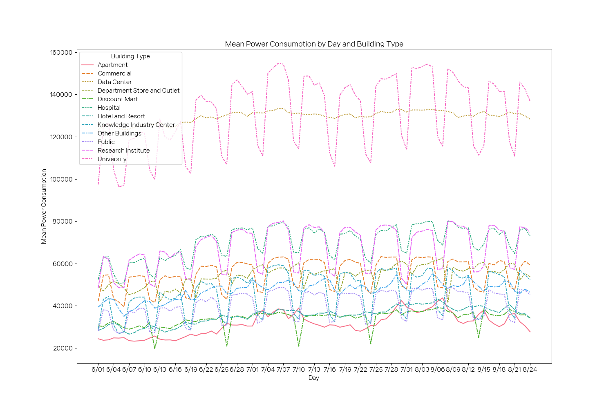

# project

## 📋 1. 프로젝트 개요

---

- 안정적이고 효율적인 에너지 공급을 위하여 전력 사용량 예측 시뮬레이션을 통한 효율적인 인공지능 알고리즘 발굴을 목표로 한국에너지공단에서 개최한 대회에 참여했습니다.
    - 관련기사 : 필요 전력량 급증하자 꺼낸 '새 원전 건설'...상황은 첩첩산중(https://m.hankookilbo.com/News/Read/A2023071115570002238)
- 프로젝트를 진행하기에 앞서 팀원들과 건물별 모델, 건물유형별 모델 중 어떠한 방식으로 진행할 것인지 논의했습니다.
    - 건물별 모델
    train 데이터가 각 건물별 2040개 밖에 되지 않아, 모델의 성능을 장담할 수 없을 것으로 예상되었고, 건물의 개수가 훨씬 많을 경우, 모델의 효율성이 떨어질 것이라 예상했습니다.
    - 건물유형별 모델
    건물유형에 따라 일별, 시간대별 평균 전력소비량에 유사한 패턴을 보이는 것으로 확인되어, 유형별 모델을 만드는 것이 대회 취지에 부합하는 모델이라는 결론을 내렸으나, 결과 제출시 모델의 예측력은 건물별 모델에 비해 낮았습니다.

## 📊 2. 데이터 전처리

---

### 2-1. 데이터 개요

1. Train data
    - 독립변수
        - 건물별 기상 data (건물별 2040개, 총 204000개 data)
        - 측정기준: 2022년 6월 1일 00시 ~ 2022년 8월 24일 23시 (1시간 단위)
        - 변수: 건물번호, 일시, 기온, 강수량, 풍속, 습도, 일조, 일사, 전력소비량
    - 종속변수
        - 건물별 1시간 단위 전력사용량
2. Test data
    - 건물별 기상 Data (건물별 168개, 총 16800개 data)
    - 측정기준: 2022년 8월 25일 00시 ~ 2022년 8월 31일 23시 (1시간 단위)
    - 변수: 건물번호, 일시, 기온, 강수량, 풍속, 습도, 일조, 일사, 전력소비량
3. Building_info
    - 변수 : 건물번호, 건물유형, 연면적, 냉방면적, 태양광용량, ESS저장용량, PCS용량

### 2-2. EDA

- 건물유형별 일별 평균 전력소비량


- 건물유형별 각 건물의 시간대별 전력소비량

.png)

.png)

.png)

.png)

.png)

.png)

.png)

.png)

.png)

.png)

.png)

.png)

### 2-3.  독립변수 추가

(1) ‘최대’ 전력량 사용  

- 전력량 과소 예측을 ‘평균’보다는 ‘최대’ 전력량 변수가 정해줄 것이라 추정하여, ‘최대’ 전력량 변수 위주로 추가했습니다. 실제로 ‘최대’ 전력량 변수가 더 높은 예측력을 보였습니다. 
(예: 건물유형별 시간별 최대 전력량, 건물유형별 요일별 최대 전력량)

(2) 불쾌지수(THI)

- 기상청이 제공하는 불쾌지수 계산 공식을 사용했습니다.
- 불쾌지수 = 9/5 × 기온 - 0.55 × (1 - 습도) × (9/5 × 기온 - 26) + 32

(3) 냉방도일(CDH)

- 우리나라 정부 및 한국에너지공단이 제시하는 냉방 기준 온도는 26도로, 온도가 26도보다 높아질 때 사람들은 실내를 서늘하게 하기 시작합니다.
- 일 평균 기온이 냉방 기준 온도보다 높은 날들의 일 평균 기온과 냉방 기준 온도의 차를 구하여 매일 누적 합산한 값이 바로 ‘냉방도일’입니다. 냉방도일이 크면 날씨가 덥다는 것을 의미하며, 전력량 측면에서 냉방 부하가 크다는 것을 의미합니다

(4) 시간의 연속적 표현을 위한 요일, 시간 변수 가공

- 시계열 도메인을 xgboost모형을 이용한 회귀 도메인으로 변경했기 때문에 시간의 특성을 반영할 수 있는 변수로 가공했습니다.
- **요일 변수**
일요일(0으로 라벨링), 토요일(6으로 라벨링)은 시간상 하루 차이지만, 숫자상으로는 가장 큰 간격을 가지므로 이를 보정하기 위해 sin처리하였습니다.
- **시간 변수**
0시와 23시 역시 시간상 1시간 차이지만, 숫자상으로는 가장 큰 간격을 가지므로 이를 보정하기 위해 sin처리하였습니다.

```python
# 시간의 연속적 표현
train_df['sin_time'] = np.sin(2*np.pi*train_df['hour']/24)
train_df['sin_wday'] = np.sin(2*np.pi*train_df['weekday']/6)
```

(5) 건물유형별 특성을 반영할 수 있는 변수

- 건물유형별 시간대별 최대 전력량
- 건물유형별 요일별 최대 전력량
- 건물유형별 전력 주사용 시간대(working hour)별 최대 전력량


- 건물유형별 시간별 전력량 그래프상, 건물유형별 전력량이 일정 수준 이상인 시간대가 존재했습니다. 
(예를 들어, 데이터 센터는 전력량이 일정하지만, 백화점 및 아울렛의 경우 영업 시간인 10시부터 7시까지가 전력량이 일정 수준 이상인 피크 시간대로 보입니다.)
- 건물유형별로 전력량이 일정 수준 이상이 되는 시간대를 ‘영업시간대(working hour)’라고 보고, 1로 라벨링. 건물 유형별 working hour의 최대 전력량 변수를 추가했습니다.

(6) 공휴일 변수

- 토요일과 일요일을 공휴일(1) 처리했습니다.
- 또한, 대형마트(85번 대형마트를 제외한 86~92)의 경우 매월 둘째, 넷째주 일요일 휴일 규정이 존재하여 건물별 일별 전력량 평균 그래프를 시각화한 후 마트 휴일을 추정하여 train, test 데이터에 휴일 처리를 추가로 진행했습니다.
- 공휴일을 라벨링한 후, 건물유형별 공휴일/평일별 최대 전력량 변수를 추가했습니다.

- 대형마트의 일별 전력량 평균

.png)

.png)

.png)

(7) 냉방면적 비율

## 📊 3. 모델링

---

### 3-1. 평가 Metric인 SMAPE

- 모델의 평가 기준인 SMAPE는 다음과 같은 산식으로 구할 수 있는 값으로, 과소 예측시 더 큰 패널티를 부여 받는  metric에 해당합니다.

```python
def SMAPE(true, pred):
    return np.mean((np.abs(true-pred))/(np.abs(true) + np.abs(pred))) * 100
```

### 3-2. xgboost 모델 사용

- 건물별 train data의 개수가 약 2040개로 딥러닝 모델보다는 부스팅 이론을 기반으로 한 머신러닝 모델이 적합하다고 판단했습니다. 실제로 LSTM 모델을 사용한 경우보다, xgboost 모델을 사용한 경우 매우 큰 성능 향상이 있었습니다.
- 시계열 도메인에서 주로 사용하는 부스팅 기반 모델인 xgboost 모델 적용했습니다. 다만, 시계열 도메인을 회귀 도메인으로 변경했기 때문에, 변수가 시계열 특성을 반영할 수 있도록 가공했습니다.
- test data와 가장 가까운 날짜일수록 예측할 데이터와 비슷한 양상을 보일 것이라고 추측하여 **train data의 마지막 일주일에 해당하는 데이터를 validation data로 설정하여 성능을 평가하는 과정을 거쳤습니다.**

### 3-3. 손실 함수 커스터마이징

(작년 우승자 j_sean팀 코드 참고)

- 작년 우승팀의 코드를 참고하여 기존 손실함수인 RMSE 대신 과소 예측 패널티를 보정할 수 있도록 커스터마이징한 손실함수를 사용했습니다.

```python
def weighted_mse(alpha = 1):
    def weighted_mse_fixed(label, pred):
        residual = (label - pred).astype("float")
        grad = np.where(residual>0, -2*alpha*residual, -2*residual)
        hess = np.where(residual>0, 2*alpha, 2.0)
        return grad, hess
    return weighted_mse_fixed
```

- 잔차( = 실제값 - 예측값)이 양수일 경우, 즉 과소 예측일 경우 alpha만큼의 가중치가 곱해져 과소 예측 패널티를 보정하는 손실함수입니다.

### 3-4. 건물유형별 모델링

- 건물유형별로 모델의 최적 parameter를 찾고 test 데이터 예측값을 출력하였습니다.
- 이전 단계의 hyperparameter는 주어진 값으로 고정하고 각 단계에서 tuning할 hyperparameter만 변화시키며 tuning하였습니다.
- 건물유형별 최적 parameter

### 3-5. 건물별 모델링

- 건물별로 모델의 최적 Parameter를 찾고 test 데이터 예측값을 출력하였습니다
- 이전 단계의 hyperparameter는 주어진 값으로 고정하고 각 단계에서 tuning할 hyperparameter만 변화시키며 tuning하였습니다.
- 건물별 최적 Parameter

## 📊 4. 결론

---

- 전체 1233 팀 중 136위 (상위 약 11%)

1. EDA의 중요성
    - 건물유형별 일별 평균 전력량 그래프에서 상이한 패턴을 보이는 건물을 별도로 처리했어야 한다는 아쉬움이 있습니다.
2. 종속변수의 분포 확인
    - 다른 참여자들의 코드를 통해, 종속변수인 전력소비량이 좌측편포를 보임을 알 수 있었습니다.종속변수의 로그변환을 통해 정규분포와 가까운 형태로 변환하여보다 나은 예측결과를 도출할 수 있을 것으로 예상합니다.
3. 최적 Parameter 관련
    - SMAPE 점수에 따른 Parameter 선택이 아닌각 Parameter가 높거나 낮다는 것이 정확히 어떠한 의미를 가지며,어떠한 값이 모델의 과적합을 방지할 수 있는지에 대한 저의 부족함을 느낄 수 있었습니다.
